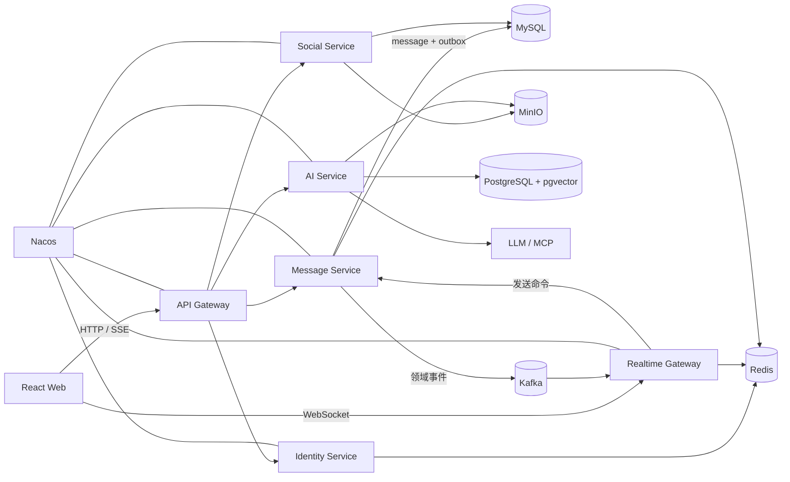

# NexusAI

面向实时通信、AI 对话与知识库问答的一体化智能协作平台。

NexusAI 以 Java 微服务和事件驱动架构为基础，围绕用户关系、私聊群聊、可靠消息、WebSocket 实时投递、AI Chat、RAG 知识库等能力展开。项目以生产级约束为设计目标，在实现业务功能的同时，重点处理身份安全、消息幂等、顺序、一致性、断线恢复、多节点路由、可观测性与故障恢复。

> 当前状态：项目处于工程基线阶段，已完成 Maven 父工程、Wrapper 和纯 Java Common 模块的依赖隔离。README 中标记为“规划”的功能将按照开发路线逐步实现，不代表当前已经可用。

## 项目目标

- 构建完整的用户、好友、群组、会话和消息系统。
- 使用 Netty WebSocket 支持低延迟双向通信。
- 使用 Kafka 与 Outbox 实现可靠的异步消息链路。
- 支持多设备、消息 ACK、已读回执和断线增量同步。
- 使用 Redis 管理登录状态、Presence、缓存、限流和临时状态。
- 使用 MinIO 管理头像、聊天附件和知识库原始文档。
- 使用 LangChain4j 构建流式 AI Chat、Memory、Tools 和 MCP 能力。
- 使用 PostgreSQL/pgvector 构建带权限、引用和评测的 RAG 知识库。
- 建立数据库迁移、自动化测试、指标、日志、链路追踪和部署体系。

## 核心功能规划

### 账号与安全

- 邮箱注册、密码登录和验证码登录。
- Access Token、Refresh Token 轮换与撤销。
- 多设备登录会话与设备管理。
- 安全密码哈希、登录限流和防账号枚举。
- Gateway 统一认证与下游可信身份。
- 对象级授权和越权防护。

### 社交关系

- 用户资料与头像。
- 好友搜索、申请、同意、拒绝、删除和拉黑。
- 好友申请过期与系统通知。
- 群聊创建、邀请、踢人、退群和成员角色。
- 私聊、群聊和 AI 会话统一管理。

### 消息系统

- 文本消息、回复、撤回和消息状态。
- `clientMessageId` 发送幂等。
- 会话内单调消息序号 `seq`。
- 基于游标的历史消息分页。
- `STORED`、`DELIVERED`、`READ` 分层 ACK。
- Outbox、Kafka 幂等消费、重试和死信队列。
- 多设备读进度、未读数和断线增量同步。

### 实时通信

- Netty WebSocket Server。
- 握手认证、心跳与空闲连接检测。
- 用户、设备、节点与 Channel 映射。
- 私聊、群聊、系统通知和 AI 消息实时投递。
- Redis Presence 和多节点定向路由。
- 慢连接背压、连接限流和故障恢复。

### 文件与对象存储

- MinIO 预签名直传。
- 文件元数据和 PENDING/READY 生命周期。
- 文件大小、MIME、哈希和上传完成校验。
- 私有下载、访问授权和孤儿对象清理。
- 头像、聊天附件和 RAG 文档统一管理。

### AI Chat

- 同步与流式模型调用。
- 会话记忆、上下文窗口和历史摘要。
- AI 消息复用普通消息存储与权限模型。
- 异步生成、取消、超时、重试和模型限流。
- 时间、邮件与 MCP 搜索工具。
- 工具执行确认、权限校验、幂等和审计。

### RAG 知识库

- 知识库、文档、Chunk 和摄取任务管理。
- MinIO 文档上传与异步解析。
- 增量切块、去重、Embedding 和版本管理。
- PostgreSQL/pgvector 向量检索。
- ACL 权限过滤、混合召回和 Rerank。
- 回答引用、删除同步、无损重建和 RAG 评测。

## 目标架构



## 模块规划

| 模块 | 职责 | 当前状态 |
|---|---|---|
| `nexus-common-kernel` | 极少量稳定公共类型，不包含业务 Entity 和基础设施实现 | 已创建 |
| `nexus-auth-service` | 账号、凭据、登录会话、Token 和验证码 | 下一阶段 |
| `nexus-api-gateway` | HTTP 路由、认证入口、限流和安全边界 | 规划中 |
| `nexus-social-service` | 用户资料、好友、群组和会话成员 | 规划中 |
| `nexus-message-service` | 消息顺序、幂等、存储、历史、读游标和 Outbox | 规划中 |
| `nexus-realtime-gateway` | Netty WebSocket、Presence、协议和在线投递 | 规划中 |
| `nexus-ai-service` | AI Chat、Memory、Tools、MCP 和 RAG | 规划中 |
| `nexus-web` | React 用户界面和 WebSocket 客户端 | 规划中 |

模块遵循单向依赖和单一数据所有者原则。跨服务协作通过版本化 API 或领域事件完成，不共享数据库持久化实体。

## 技术栈

### 后端

- Java 21
- Spring Boot 3.5
- Spring Cloud Gateway
- Spring Security
- Spring Cloud OpenFeign
- Spring Cloud LoadBalancer
- Spring Cloud Alibaba Nacos
- MyBatis-Plus
- Flyway
- Netty
- Apache Kafka
- Redis
- Canal
- ShedLock
- MinIO
- LangChain4j
- PostgreSQL + pgvector

### 前端

- React
- TypeScript
- Vite
- HTTP / SSE / WebSocket

### 测试与工程化

- JUnit 5
- Testcontainers
- Maven Wrapper
- Docker Compose
- Spring Boot Actuator
- Micrometer
- Prometheus / Grafana
- OpenTelemetry
- CI 质量门和依赖/Secret 扫描

## 关键设计原则

### 可信身份

客户端不能通过请求参数决定自己是谁。业务操作的 `actorId` 必须来自经过验证的 Token 或服务端安全上下文，所有资源访问执行对象级授权。

### 先持久化，再投递

聊天消息在数据库事务中完成权限校验、幂等判断、序号分配以及 `message + outbox` 写入。事务提交后再发布事件和执行实时投递，避免“已推送但未保存”。

### 至少一次与幂等

网络请求、Outbox 发布和 Kafka 消费均按至少一次语义设计。重复请求和重复事件通过业务唯一键、幂等记录和状态约束安全处理。

### 基于序号的同步

消息历史和断线恢复使用 `(conversationId, seq)` 游标，不依赖客户端时间或一次断线时间。用户成员关系维护送达和已读水位。

### 缓存不承担唯一真相

MySQL 保存核心业务真相。Redis 和 Canal 构建可回源、可重建的临时状态或查询投影；缓存故障不应破坏消息正确性。

### AI 工具最小权限

模型输出被视为不可信建议。邮件、知识写入等外部副作用必须经过参数校验、授权、必要的用户确认、幂等执行和审计。

## 当前目录

```text
NexusAI/
├── .mvn/
├── docs/
│   ├── architecture-improvement-ledger.md
│   └── development-roadmap.md
├── nexus-common-kernel/
│   └── pom.xml
├── .gitignore
├── mvnw
├── mvnw.cmd
├── pom.xml
└── README.md
```

## 环境要求

- JDK 21
- Maven 3.9.9，推荐直接使用项目内 Maven Wrapper
- Git
- Docker
- Docker Compose

当前已验证环境：macOS ARM64、OpenJDK 21、Maven 3.9.9、Docker 29、Docker Compose 5。

## 构建方式

```bash
./mvnw clean verify
```

检查 Common 模块依赖边界：

```bash
./mvnw -pl nexus-common-kernel dependency:tree
```

当前 Common 应保持纯 Java JAR，不应出现 Spring Web、MySQL、Redis、Nacos 或 AI 相关依赖。

随着各服务和基础设施逐步实现，README 将补充 Docker Compose 启动、数据库迁移、服务启动和端到端验证命令。

